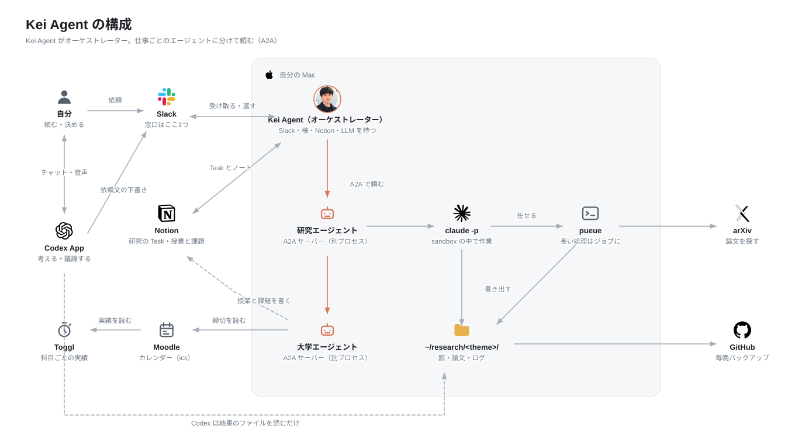

# Kei Agent

Slack で頼むと、自分の Mac のエージェントが動いて、経過と結果を同じスレッドに返すアシスタント。

Kei Agent 本体がオーケストレーターになり、研究の作業は**研究エージェント**、授業と課題は
**大学エージェント**、会社の予定やメールは**仕事エージェント**に、A2A で振り分ける。



```zsh
@Kei Agent この CSV から学習曲線を描いて        →  #10_<テーマ>   研究エージェント
@Kei Agent 情報セキュリティの過去問ってある？    →  #20_course     大学エージェント
@Kei Agent 今週の予定は？                       →  #30_work       仕事エージェント
```

朝になると `#01_overview` に、今日の予定（授業・会議・締切）と Daily が1通で届く。

## ドキュメント

| 読みたいこと | 場所 |
|---|---|
| Slack で何が頼めるか、定期実行、設定画面 | [`docs/using.md`](docs/using.md) |
| 入れ方（Slack App、秘密情報、常時起動） | [`deploy/README.md`](deploy/README.md) |
| 仕組みと、そう決めた理由 | [`docs/design.md`](docs/design.md) |
| エージェントを増やすときの決まり | [`docs/agents.md`](docs/agents.md) |
| Notion の構成 | [`docs/notion-layout.md`](docs/notion-layout.md) |
| Codex App 側の使い方、依頼文のテンプレート | [`docs/codex.md`](docs/codex.md) |
| 変更の手順、コミットメッセージの書き方 | [`CONTRIBUTING.md`](CONTRIBUTING.md) |

## 開発

```zsh
brew install pueue && brew services start pueue
uv sync
uv run --group work pytest
uvx ruff check .
```

コードの地図は [`docs/design.md`](docs/design.md#14-コードの地図)。

## ライセンス

MIT（`LICENSE`）
