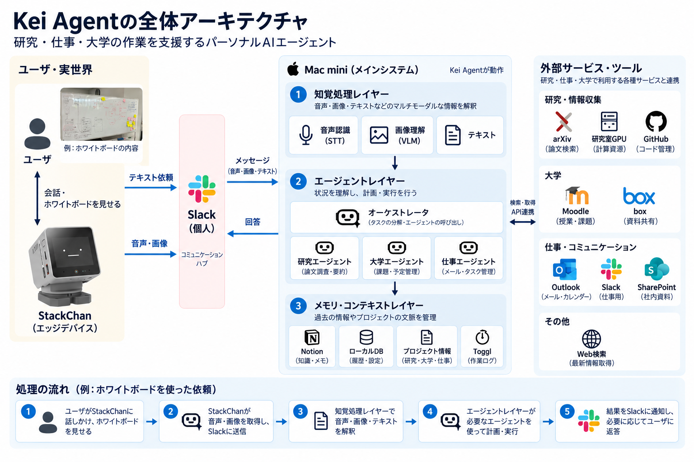

# Kei Agent

> Slackから頼んだ用事を、担当のエージェント（研究・大学・仕事）に振り分けて進める個人用アシスタント



## 概要

- Slackチャンネルの推奨構成は以下の通り

```text
00_kei-agent
01_overview
02_research-strategy
10_amr-query
20_course
30_work
```

- Slackの決まったチャンネルに、依頼文を流すとオーケストレータ（Haiku）が担当のエージェントに振り分ける

### 研究エージェント

- Slackの`10_〇〇`チャンネルで動作する
- 研究室のサーバやGPU・Slack・arXivと連携している
- 研究室のSlackの教授・先輩からのアドバイスやarXivから取得した先行研究を確認できる
- 計算資源を研究室のGPUなどにSSH接続することで、Slack上でも話し合った内容を研究エージェントが実装・実行まで行ってくれる

### 大学エージェント

- Slackの`20_corse`チャンネルで動作する
- BoxとMoodleと連携しており、課題情報や過去問・学部要項などの大学情報に特化したエージェント

```text
@Kei Agent マルチメディア工学Aの過去問で頻出のテーマってなに？
@Kei Agent 大学を卒業するのに必要な単位数って何単位？
```

### 仕事エージェント

- Slackの`30_work`チャンネルで動作する
- OutlookやTeams、Sharepoint、notion等と連携しており、仕事関連の予定やドキュメント探しに特化したエージェント

```text
@Kei Agent 直近で私が返信しなければいけないメールってある？
@Kei Agent 〇〇関連のドキュメントってどこにある？
```

### 定期実行

- 朝になると`#01_overview`に今日の予定とDailyが届く

### 自己改善

- `#00_kei-agent`に本システムのバグや不具合などを報告すると、自動でコードを編集して`push`を行う

## ドキュメント

| 読みたいこと | 場所 |
|---|---|
| Slack で何が頼めるか、定期実行、設定画面 | [`docs/using.md`](docs/using.md) |
| 入れ方（Slack App、秘密情報、常時起動） | [`deploy/README.md`](deploy/README.md) |
| 仕組みと、そう決めた理由 | [`docs/design.md`](docs/design.md) |
| エージェントを増やすときの決まり | [`docs/agents.md`](docs/agents.md) |
| Notion の構成 | [`docs/notion-layout.md`](docs/notion-layout.md) |
| Codex App 側の使い方、依頼文のテンプレート | [`docs/codex.md`](docs/codex.md) |
| 変更の手順、コミットメッセージの書き方 | [`CONTRIBUTING.md`](CONTRIBUTING.md) |

## 開発

```zsh
brew install pueue && brew services start pueue
uv sync
uv run --group work pytest
uvx ruff check .
```

コードの地図は [`docs/design.md`](docs/design.md#14-コードの地図)。

## ライセンス

MIT（`LICENSE`）
