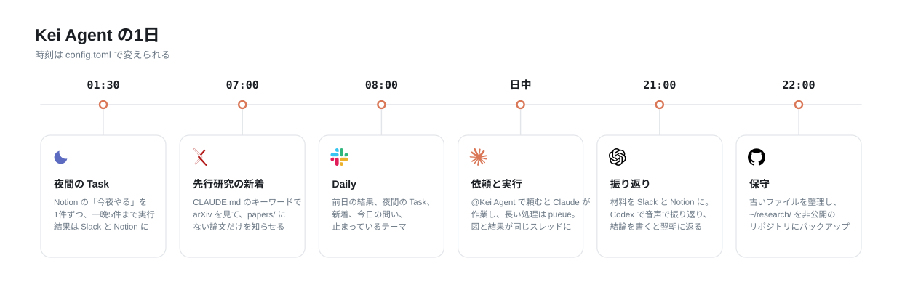

# Kei Agent

- Slack で頼むと、自分の Mac のエージェントが動いて、経過と結果を同じスレッドに返すアシスタント

- Kei Agent がオーケストレーターとなり、研究の作業は研究エージェント、大学の授業は大学エージェントに、仕事は仕事エージェントに A2A で振り分ける
- Agentの構成は以下の通り


## 利用方法



### 朝起きたとき

- 研究エージェントから、先行研究の新着・Dailyが届く
- 仕事エージェントから、一日の予定が届く
- 大学エージェントから、直近の締切課題が届く

### 日中

#### 研究をしたいとき

1. Slackに研究テーマごとにチャンネルを作る
2. Kei Agent を該当チャンネルに招待するとPC上に研究用のディレクトリとNotionのテーマができる
3. テーマのチャンネルで `@Kei Agent 〜して` と頼むとAgentが作業を始める
    - この時、添付したファイルは `inputs/` に保存され、`outputs/` に新しくできたファイルはスレッドに添付される
    - 依頼のメッセージには、受け取ったら 👀、答え終わったら ✅（止まったら ⚠️）のリアクションがつく
    - 長い処理は Kei Agent がジョブにし、終わると同じスレッドで会話を再開して報告する

#### 仕事をしたいとき

### 自己改善型エージェント
- Kei Agent への要望は `#research-agent` に `@Kei Agent` をつけて書く
- 改善案に同意すると Kei Agent が自分のコードを直し、差分を見せてから取り込み、GitHub に push して、作業が終わったタイミングで新しいverに入れ替わる

### 定期実行
- 決まった時刻に、先行研究の新着（07:00、テーマのチャンネル）、Daily（08:00）、振り返りの材料（21:00）が届く

### 音声対話アシスタント
- 未実装（Stack Chan）で実装予定
- 机の上で声で相談できるアシスタント
- 相談相手は Codex（声では「Kei」と名乗る）、作業は Slack の Kei Agent（Claude）
- 決まったことと依頼は Slack に残り、作業が終わると声で一言知らせる

## ドキュメント

| 内容 | 場所 |
|---|---|
| セットアップ（Slack App、秘密情報、常時起動） | `deploy/README.md` |
| Codex App 側の使い方、依頼文のテンプレート | `docs/codex.md` |
| 設計とフェーズ | `docs/plan.md` |
| Notion の研究ホームの構成 | `docs/notion-layout.md` |
| 構成図（`docs/architecture.svg`）と1日の流れ（`docs/schedule.svg`） | `docs/` |
| 変更の手順、コミットメッセージの書き方 | `CONTRIBUTING.md` |

## 保守

- 毎晩 22:00 に、古いファイルを整理し、`~/research/` を非公開の GitHub リポジトリにバックアップする
- ログは 5MB ごとに回す（`deploy/README.md` の8章）

## 開発

```zsh
uv sync
uv run pytest
```

| 部品 | 役割 |
|---|---|
| `src/kei_agent/app.py` | Slack Bolt（Socket Mode）の受け口と起動 |
| `src/kei_agent/assistant.py` | 依頼の受け付け、経過、結果の返信、ジョブ完了時の再開 |
| `src/kei_agent/thread_ui.py` | 作業中の見せ方（手順と返事を流して見せる、スレッドの状態） |
| `src/kei_agent/auto_messages.py` | Claude に渡す自動メッセージ（履歴の復元、ジョブの完了、接続先の返事、引き継ぎ） |
| `src/kei_agent/slack_text.py` | Slack に出す文字の扱い（印の絵文字、返答の合図、長い文の分割） |
| `src/kei_agent/theme_files.py` | テーマのディレクトリの読み書き（添付の保存、`outputs/` の変化、スレッドのログ） |
| `src/kei_agent/handoff.py` | 長くなったスレッドを区切って、新しいスレッドで続ける |
| `src/kei_agent/settings_actions.py` | 接続先の申し出のボタンと、App Home の操作 |
| `src/kei_agent/self_fix.py` | Slack から Kei Agent 自身を直す流れ（`improve.py` の部品を使う） |
| `src/kei_agent/runner.py` | `claude -p` の起動、sandbox と権限の設定、stream-json の読み取り |
| `src/kei_agent/jobs.py` | ジョブの依頼の検証、pueue への投入、状態の追跡 |
| `src/kei_agent/themes.py` | チャンネル、テーマ、作業用ディレクトリの対応 |
| `src/kei_agent/schedule.py` | 決まった時刻の処理（先行研究、Daily、振り返り、夜間 Task、声かけ） |
| `src/kei_agent/notion.py` | Notion の API の接続と、研究ホームを作るコマンド |
| `src/kei_agent/notion_store.py` | Task とノートの読み書き（夜間の Task、Daily、振り返り） |
| `src/kei_agent/maintenance.py` | 毎晩の保守（古いファイルの整理、研究データのバックアップ） |
| `src/kei_agent/timelog.py` | 研究時間の記録（人は Toggl、Kei Agent は `runs`）と、週ごとの材料の書き出し |
| `src/kei_agent/ask.py` | Slack の外（声のレイヤなど）から依頼を渡す口と `kei-agent-ask` |
| `src/kei_agent_voice/` | 机の上の音声対話（Codex に相談し、VOICEVOX で読み上げ、Kei Agent に依頼を渡す） |
| `prompts/voice.md` | 声で話すときの Kei の決まり |
| `src/kei_agent/guard.py` | 柵（sandbox の設定、読ませない場所、操作してよい人、取り込んでよい差分の判定）。Kei Agent 自身に直させない |
| `src/kei_agent/improve.py` | Slack から Kei Agent 自身を直す流れ（worktree、確認、取り込み、push、入れ替え） |
| `src/kei_agent/settings.py` | Slack から変える設定（テーマごとの接続先、決まった時刻の処理の時刻） |
| `src/kei_agent/home.py` | App Home（Slack で Kei Agent を開いたときの設定画面） |
| `src/kei_agent/store.py` | SQLite（スレッドとセッション、ジョブ、夜間 Task、定期処理、実行時間、接続先、改善） |
| `docs/agents.md` | **エージェントを増やすときの決まり**（層、名前のそろえ方、返事の封筒、柵、手順） |
| `src/kei_agent_a2a/` | A2A サーバーの土台（名刺と窓口、返事の封筒、エージェントが claude を動かす共通部分） |
| `src/kei_agent_course/` | 大学エージェント（Moodle・Notion の授業/課題・Toggl・Box。自分の claude で質問に答える） |
| `src/kei_agent_research/` | 研究エージェント（テーマのディレクトリで `claude -p` を1回動かし、pueue の待ち行列を持つ） |
| `src/kei_agent_work/` | 仕事エージェント（会社の Microsoft 365 の連携で、予定・メール・SharePoint・Teams を読む） |
| `src/kei_agent/morning.py` | 朝のまとめ（授業・会議・締切を、時刻の早い順に1本へ並べる） |
| `src/kei_agent/a2a.py` | ほかのエージェントに仕事を頼む口（A2A のクライアント。長い仕事は流しながら受け取る） |
| `src/kei_agent/agents.py` | エージェントの住所と、返事の封筒の読み方（どのエージェントも同じ形） |
| `src/kei_agent/router.py` | どの仕事に振るかを軽いモデルで判定する（名刺からスキルの一覧を作る） |
| `src/kei_agent/course.py` | 大学のチャンネル（`#20_course`）の依頼を、大学エージェントに振り分ける |
| `src/kei_agent/research.py` | claude の1回分を、研究エージェントに頼む |
| `prompts/course.md` | 大学エージェントの claude の指示書 |
| `plugin/` | `claude -p` に読み込ませる skill（`kei-agent:job`、`kei-agent:literature`） |
| `prompts/system.md` | `claude -p` に足すシステムプロンプト |

## ライセンス

MIT（`LICENSE`）
