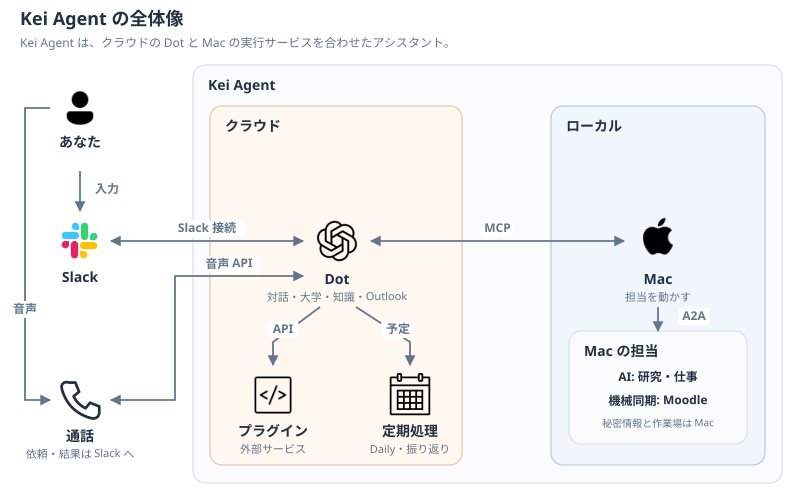

# Kei Agent

Slack で頼んだ用事を、担当のエージェントが進めるパーソナルアシスタント。

- 機能はどれもモジュールで、使うものだけをオンにする
- 自分のモジュールを足して作り替えられる
- 自分の Mac で常駐し、AI は Claude Code か Codex の CLI で動く



## 何ができるか

| モジュール | 名前 | できること |
|---|---|---|
| 研究 | `research` | テーマのチャンネルごとの作業場で、コード・実験・論文探しをし、研究ホーム（Notion）に残す |
| 大学 | `course` | Moodle の締切を知らせ、授業ホーム・Box の要項と過去問を読んで答える |
| 仕事 | `work` | 会社の Outlook・Teams・SharePoint を読んで答える。送信はしない |
| 知識 | `knowledge` | 技術記事と論文の新着を毎朝選んで要約し、その質問に答える |
| Daily・振り返り | `daily` | 朝に今日の予定と Daily、夜に振り返りを出す |
| 時間記録 | `time` | `/toggl` とカードで時間を測り、Toggl と Notion に送る |
| 自己改善 | `improve` | 要望から Kei Agent 自身のコードを直し、承認されたら取り込む |
| 声 | `voice` | 出来事を喋って知らせる。マイクで会話もできる |
| Notion | `notion` | Notion への唯一の出入口。使う側ごとに届くホームを絞る |

## はじめる

- 要るもの: macOS、自分用の Slack のワークスペース、Claude Code か Codex の CLI、[uv](https://docs.astral.sh/uv/)、pueue
- あれば使うもの: Notion、Toggl、OpenAI（声の会話）

```zsh
git clone https://github.com/97kuek/kei-agent.git ~/src/kei-agent
cd ~/src/kei-agent
brew install pueue ffmpeg && brew services start pueue
uv sync --all-groups
uv run kei-agent setup     # 設定・プロフィール・秘密情報を作り、常駐の登録まで進む
uv run kei-agent doctor    # 困ったら点検（読むだけ）
```

## 自分のモジュールを作る

```zsh
uv run kei-agent module new weather --ai    # ひな形を作る（担当プロセスも持つなら --process）
uv run kei-agent module test weather        # 本物に触れないテスト
uv run kei-agent module add weather         # オンにする
```

## ドキュメント

| 読みたいこと | 場所 |
|---|---|
| Slack での使い方 | [`docs/using.md`](docs/using.md) |
| 担当（研究・大学・仕事・知識）ごとの中身 | [`docs/agents.md`](docs/agents.md) |
| 仕組み（プロセス・AI の動かし方・柵・定期実行・Notion） | [`docs/architecture.md`](docs/architecture.md) |
| モジュールの作り方 | [`docs/modules.md`](docs/modules.md) |
| 設計の決めごと | [`docs/extensibility.md`](docs/extensibility.md) |
| 入れ方と運用 | [`deploy/README.md`](deploy/README.md) |
| 開発の手順 | [`CONTRIBUTING.md`](CONTRIBUTING.md) |

## ライセンス

MIT（`LICENSE`）
