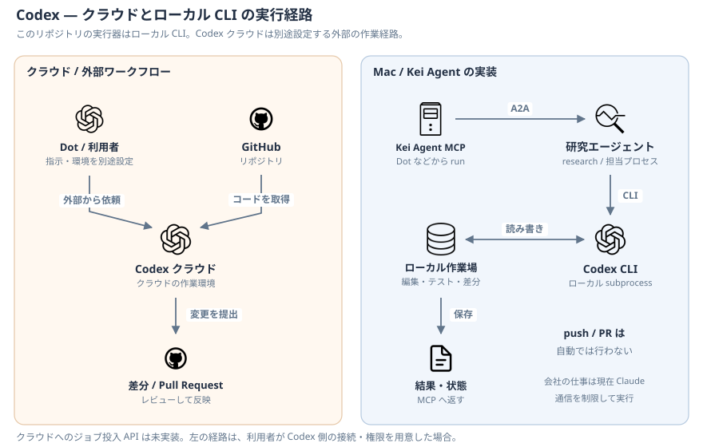

# 個人開発（クラウド Codex）

個人のアプリ・サイト・Kei Agent 自身の改善を、プロジェクト別に進める。Dot が公開済みの Codex クラウド環境へ依頼し、Mac を経由せず実装・テスト・PR 作成まで行う。これは Dot の役割であり、Mac に新しい担当プロセスを追加する機能ではない。

## プロジェクトを登録する

| 設定 | 内容 |
|---|---|
| Slack | `#5-<プロジェクト>`。名前とチャンネル ID を確認する |
| リポジトリ | 所有者を含む GitHub リポジトリ名 |
| クラウド環境 | リポジトリとセットアップを確認して Publish した環境 |
| 開発規約 | 対象リポジトリの `AGENTS.md` と開発ドキュメント |
| 検証 | CI の検査と、Mac・実データが必要な検査の区別 |

対応表は利用者の Dot に設定する。個人のチャンネル ID やパスを共通コードに埋め込まない。GitHub プラグインの接続だけでクラウド環境が作られるわけではない。[貼り付け用指示](../prompts/dot-development.md)を使う。

## 依頼から PR まで

1. Dot がチャンネルに対応するリポジトリ・公開済み環境を選ぶ。未登録なら確認する。
2. 依頼・完了条件・必要な文脈をクラウドタスクへ渡し、元の Slack スレッドとタスク URL を対応づける。
3. Codex が専用ブランチで実装・検証し、push と PR 作成を行う。
4. Dot が PR・CI 結果・未検証事項を元スレッドに返す。追記は同じタスクで続ける。
5. マージと本番反映は利用者の指示を待つ。main への直接 push・自動マージ・手動デプロイを PR 作成の許可に含めない。

Dot の標準クラウド委任を使う。Mac の MCP `run`・`status`・`notices`・`create_workspace` はこの経路には使わず、Mac の停止時もクラウドで継続する。クラウド環境が使えなければ未接続と伝え、ローカル実行へ勝手に切り替えない。

## 状態と検証

- 実際のタスク作成前は実行中と報告しない。受付・実行中・確認待ち・PR 作成済み・失敗・Mac 待ちを区別する。
- 投入結果が不明な場合は既存タスクを確認してから再投入し、同じ依頼から重複 PR を作らない。
- 検査の成功・失敗・未実行を分ける。クラウドで実行できない検査を CI が補った場合は実行場所を記録する。
- 進捗はクラウドタスクの結果から確認する。Mac の MCP の状態を代用しない。専用の状態同期・機械的リアクション更新はこのリポジトリには実装していない。
- Mac 固有のアプリ・サービスの検証は別工程として残す。クラウドテスト成功だけで Mac での動作確認済みとしない。
- PR の push がプレビューを起動するかは対象の CI と外部ホスティング設定による。初期登録時に確認し、プレビューの可否を利用者の方針に合わせる。

## 新規開発と自己改善

新規開発は要件・設計を決めてからリポジトリとクラウド環境を作る。公開範囲は利用者が指定する。実データ・認証情報をリポジトリに含めない。

Kei Agent 自身も1つのプロジェクトとして `#5-kei-agent` から依頼する。Mac への更新・再起動は利用者の指示後に行う。任意のローカル `improve` モジュールとは別の経路であり、チャンネル改名だけで同モジュールの動作は変えない。

## 導入確認

環境の公開、Dot による読み取りタスク、変更と PR 作成、CI と結果返却、Mac が利用不可の状態での新規依頼を順に確かめる。文書の更新は Dot の実設定を変更しない。

公式資料: [Dot のタスク](https://learn.chatgpt.com/docs/dots/tasks-and-memory)、[クラウド環境](https://learn.chatgpt.com/docs/environments/cloud-environments)。通常の `@ChatGPT` Slack アプリの Cloud delegation は共有環境などの条件が異なるため、個人 Dot の経路と区別する。
