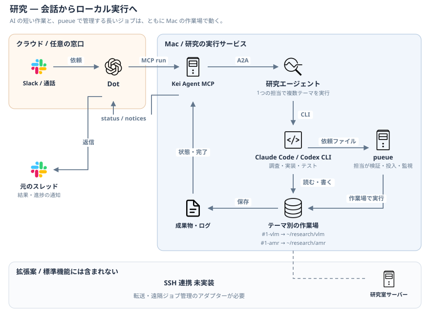

# 研究エージェント（`research`）

- 研究テーマのチャンネルで、そのテーマの作業場を使って作業する
- コードを書く・実験を回す・論文を探す・研究ホーム（Notion）に残す
- 長い処理はジョブにして、終わったら同じスレッドで報告する

| 項目 | 中身 |
|---|---|
| チャンネル | ほかのどれでもないチャンネル（`#1-<テーマ>` など）。`module.toml` の `[channels]` の `theme = ["*"]` |
| ポート | 8788 |
| フォルダ | `modules/research/`（指示書 `research.md`、skill は `plugin/`） |
| 触れる範囲 | 作業場を読み書き・コマンド・Web・研究ホーム（[制限の表](../agents.md#触れる範囲制限の表)） |

研究エージェントは1つの担当プロセスで複数のテーマを扱う。`#1-<テーマ>` ごとに作業場・会話・前提を分ける。先頭の `1-` は並び順の命名例で、担当は `[channels] theme = ["*"]` の振り分けで決まる。テーマごとに別プロセスを起動する仕組みではない。

## テーマの作業場

- Slack でチャンネルを作って Dot を招き、作業場の作成を頼む。Dot が MCP の `create_workspace` で作業場・`AGENTS.md` のひな形（と、それを読み込む `CLAUDE.md`）・Notion の「テーマ」の行を作る
- 既定の場所を使うか、既存のフォルダを `folder` に指定する

```text
~/research/<テーマ>/     既定の置き場所（agents.csv の research の行の folder）
├── AGENTS.md            前提・分野・## 検索キーワード・ジョブにする基準（Claude と Codex が読む）
├── CLAUDE.md            AGENTS.md を読み込む1行
├── inputs/              添付されたファイル
├── outputs/             見せたい図や集計（新しいものはスレッドに添付）
├── logs/                ジョブのログ
└── .kei-agent/          スレッドのログとジョブの状態（Kei Agent が書く）
```

| 既存のフォルダを使うとき | 扱い |
|---|---|
| 対応の置き場所 | `~/.config/kei-agent/themes.toml` に「テーマの名前 = フォルダ」。書き換えると読み直す |
| 前提のメモ | `AGENTS.md` か `CLAUDE.md` があれば、動かさずにそのまま使う（`CLAUDE.md` だけなら Codex には渡らない）。どちらも無いときだけ `AGENTS.md` のひな形を作る |
| `.kei-agent/` | Git のリポジトリなら `.git/info/exclude` に入れる |
| `inputs/` など | 初めて使うときに作る |
| 毎晩の保存 | しない（その人の Git に任せる） |
| 保護フォルダ（書類など） | `allow_protected_folders = true` と、フルディスクアクセスの許可が要る |

## 頼み方

| 頼み方 | 起きること |
|---|---|
| Slack の Dot に「〜して」（テーマのチャンネル） | Dot が MCP の `run` に頼み、作業場で AI を動かして答える |
| ファイルを添付 | Dot が `put_file` で `inputs/` に置く（文のファイル） |
| 依頼の頭に `[[research-design]]` など | Dot が `run` の `use_case` に用途を指定する。下の表 |
| 「今夜やって」 | Dot が Task を「今夜やる」で作り、00:00 に動かす |

## AI の用途

モデルと effort の設定は `modules/research/module.toml` の `[use_cases]`、許可するモデルは `src/kei_agent/framework/models.py` を参照する。

| 用途 | 使うとき |
| --- | --- |
| `research_extract` | 書誌・固定項目・ログの抜き出し |
| `research_screen` | はっきりした基準での仕分け |
| `research_compare` | 比較・結果の分析 |
| `research_execute`（既定） | 実験コード・データ処理・ふつうの調査 |
| `research_design` | 仮説・実験計画・手法選び・厳しいレビュー |
| `manual_fable` | `[[manual-fable]]` と書いたときだけ |
| `manual_astra` | `[[manual-astra]]` と書いたときだけ |

## スキル

| スキル | 中身 |
|---|---|
| `ask` | テーマの作業場で AI を1回動かす |
| `submit-job` | ジョブを pueue に入れる（作業場か研究全体の作業場の中だけ） |
| `list-jobs` / `cancel-job` / `forget-job` | ジョブの状態を見る・止める・片づける |

- skill（`plugin/skills/`）: `researching-literature`（論文探しと先行研究 DB）、`running-jobs`、`managing-research-notion`、`managing-wandb`

## ジョブ



- 数分以上かかる処理は、Mac の作業場の中のスクリプトを pueue（グループ `kei-agent`）で動かす
- `--expect <ファイル>` で、できるはずのファイルを宣言する。終わったときに照合する
- 本体が定期的に状態を見て、終わったら Outbox に通知する。Dot が同じ `conversation` で MCP の `run` に結果の確認を頼む。ログの末尾は、進捗だけの行をまとめ、末尾に入らなかったエラーも添えて渡す
- 失敗したら、原因と直し方を報告して、入れ直してよいか聞く（頼まれるまで入れ直さない）
- 失敗や確認待ちを24時間放っておくと、一度だけ声をかける

## 通信と実行範囲

研究担当は Web・コマンドの通信を使えるが、実装されたジョブ管理は Mac の pueue が対象。研究室サーバーへの SSH 接続、ファイル転送、リモートジョブの投入・監視の専用連携は未実装。AI は `~/.ssh` を読めず、`SSH_AUTH_SOCK` も引き継がない（[柵](../architecture.md#柵)）。

## 研究ホーム（Notion）

- 作るのは `uv run kei-agent-notion-setup --apply`（付けなければ、作るものを並べるだけ）

| DB | 主な項目 |
|---|---|
| テーマ | 名前（チャンネル名と同じ）、状態、目的、Slack、ディレクトリ |
| Task | タイトル、テーマ、状態（未着手 / 今夜やる / 実行中 / 確認待ち / 完了）、担当、優先度、期日、結果 |
| ノート | タイトル、種類（計画 / 考察 / 議論メモ）、テーマ、日付 |
| マイルストーン | 名前、期日、テーマ、状態 |
| 先行研究 | 名前、テーマ、URL、ID（`arXiv:…`）、要点、この研究との関係、状態（未読 / 読んだ / 使う） |

- 「今夜やる」の Task は、00:00 に Dot が1件ずつ（一晩5件まで）MCP の `run` に頼み、「状態」と「結果」を書く
- テーマの前提と検索キーワードの正本は `AGENTS.md`、論文の正本は先行研究 DB
- スレッドやジョブの状態は本体の SQLite が正本で、Notion には置かない

## 設定と秘密情報

| 名前 | 場所 | 中身 |
|---|---|---|
| `folder`（research の行） | `agents.csv` | テーマのフォルダを置く場所（既定 `~/research`） |
| `allow_protected_folders` | `config.toml` | 保護フォルダを選べるようにする |
| `S2_API_KEY`（任意） | `kei-agent-research.zsh` | Semantic Scholar の鍵。論文を探す回数の上限が上がる |

- 研究をオフにすると、研究テーマのチャンネルには答えない。自分のモジュールに `theme = ["*"]` を持たせれば代わりに受け持てる
