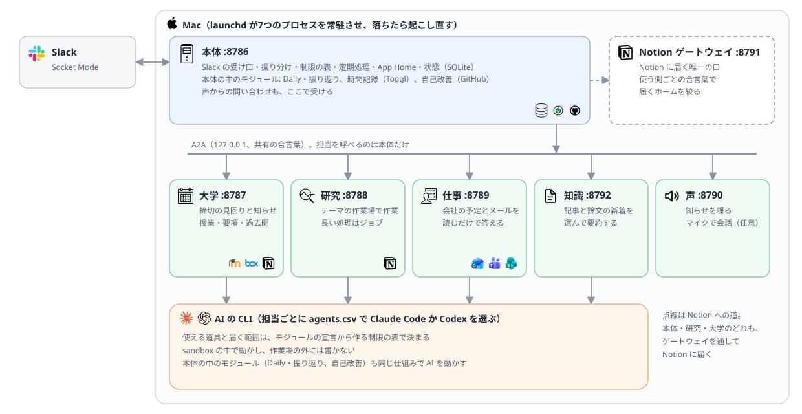

# 仕組み

- Kei Agent のいまの作り（本体と、モジュールの枠）
- 担当ごとの中身は [`agents.md`](agents.md)、モジュールの作り方は [`modules.md`](modules.md)



## プロセス

| プロセス | 番地 | 起動 | 中身 |
|---|---|---|---|
| 本体 | 8786 | `kei-agent` | Slack の受け口・振り分け・制限の表・定期処理・App Home。Daily・振り返り、時間記録、自己改善もこの中で動く |
| 大学・研究・仕事・知識 | 8787・8788・8789・8792 | `kei-agent-module <名前>` | 担当（[agents.md](agents.md)） |
| 声 | 8790 | `kei-agent-module voice` | 喋る・聞く（下の「声」） |
| Notion ゲートウェイ | 8791 | `kei-agent-module notion` | Notion への唯一の口（下の「Notion」） |

- どれも launchd で常駐し、`127.0.0.1` だけで話す
- 起動スクリプトは、本体が `deploy/run.sh`、ほかが `deploy/run-agent.sh <名前>`。`uv sync` のあと仮想環境の Python を直に起動する
- 反映は `deploy/update.sh`（[deploy/README.md](../deploy/README.md)）

## 置き場所

```text
~/.config/kei-agent/        自分のもの（KEI_AGENT_HOME で変えられる）
├── config.toml             設定（リポジトリには config.example.toml だけ）
├── profile.md              話し方・所属・興味。会話する担当の指示書に足す
├── prompts/                指示書の差し替え（同じ名前なら、そちらを使う）
├── modules/                自分のモジュール
├── themes.toml             研究テーマとフォルダの対応（任意）
└── secrets/                秘密情報（[paths] secrets で変えられる。AI には読ませない）
~/.local/state/kei-agent/   状態（kei-agent.db、notion.json、asks/、modules/<名前>/）
~/research/<テーマ>/        研究テーマの作業場（agents/research-agent.md）
~/course/                   大学の作業場
~/kei-agent/                Kei Agent 自身の作業場（overview/）と、毎晩の書き出し（state/）
```

## Slack の受け口

| 項目 | 中身 |
|---|---|
| つなぎ方 | Socket Mode。頼めるのは `KEI_AGENT_ALLOWED_USER_ID` の1人だけ |
| チャンネル | 頭の番号を外して `[channels]` と照合する。当たらなければ研究テーマ |
| 返事 | `chat.startStream` で流す。経過は `assistant.threads.setStatus`、状態は `agents.sessions.setStatus` |
| 並行 | 違うスレッドは `max_concurrent_runs`（既定2）まで。同じスレッドは順番 |
| 会話 | 1スレッド = 1会話（[agents.md](agents.md#どの担当にも共通)） |
| 日付 | どの担当への依頼にも、頭に今日の日付と曜日を付ける |
| 再起動 | 処理中の依頼は控えを残し、止まったものは起動してからやり直す |
| 上限 | 明ける時刻をスレッドに書き、明けたらやり直す（分からなければ30分後） |
| 外の文字 | 予定の件名などは、出す前に `<` `>` `&` を逃がす |

## 振り分けと A2A

| チャンネル | 行き先 |
|---|---|
| 研究テーマ | 研究 |
| `#20_course`・`#30_work`・`#40_knowledge` など | そのモジュールの `on_message`。担当のスキルか `ask` に頼む |
| `#01_overview` | 軽いモデルが、名刺のスキル一覧から相手と仕事を選ぶ |
| `#00_kei-agent` | 自己改善。オフなら、困りごとを知らせるだけの場所 |

- A2A v1.0: 名刺は `/.well-known/agent-card.json`、JSON-RPC の `SendMessage` / `GetTask`、長い仕事は `SendStreamingMessage`
- 合言葉は `KEI_AGENT_A2A_TOKEN`（Bearer）。全プロセスで同じ値
- 担当を呼べるのは本体だけ。声も本体の口（:8786）に頼む
- 名刺の `version` は起動したときの commit。本体は、古い版のまま動く担当を起動し直す
- 返事の形は [agents.md](agents.md#どの担当にも共通)

## AI の動かし方

- AI を起動するのは `runner.run_model` だけ（Claude も Codex も）
- 1回の条件は `ExecutionRequest` と `ExecutionContract` にまとめる
- 触れる範囲は制限の表（`agent_policy.py`）が決める。担当ごとの表は [agents.md](agents.md#触れる範囲制限の表)

| | Claude | Codex |
|---|---|---|
| 起動 | `claude -p`（stream-json） | `codex exec --json` |
| 許可 | 表から `--settings` の許可と拒否を作り、`dontAsk` | 表から一時的な権限 profile `kei_agent_scoped` を作る |
| ユーザー設定 | 持ち込まない（`--setting-sources ""`、`--strict-mcp-config`） | 持ち込まない（`--ignore-user-config`） |
| 連携 | その担当のプロファイル（`CLAUDE_CONFIG_DIR`）の、表に書いた道具だけ | 表の App の、表に書いた読む道具だけ |

- read-only（読むだけ）の実行は、書く・動かす手段を外す（声からの問い合わせ、分類など）
- `offline = true` の用途は Web も外す（外の文・個人のデータ・外へ出す口を1回に揃えない）
- plugin は担当の1つだけ。フック（`plugin/hooks/policy.py`）は安全違反を断る第二の防御で、Claude にも Codex にも掛ける
- Notion の MCP は `kei-notion`。合言葉は担当の名前で作る
- 作業場の前提は `CLAUDE.md` に置き、どの provider でも読む
- 走らせた記録（SQLite の `runs`）に、担当・用途・provider・モデル・effort・かかった時間・費用・失敗を残す。担当のプロセスで決まった用途とモデルも、返事の封筒で本体に戻す
- 残さないのは、知識の朝の読みもの・論文の新着、声からの問い合わせ、振り分け

### actor とモデル

- AI の実行役（actor）ごとに、App Home で provider を選ぶ。既定は無く、選ぶまで動かない
- actor: `research` / `course` / `work` / `knowledge` / `router`（振り分け）/ `daily` / `improve`
- 使ってよいモデルは `model_policy.py` にだけ置く。モジュールはその中からしか選べない

| provider | 使ってよいモデル |
|---|---|
| Claude | `claude-haiku-4-5` / `claude-sonnet-5` / `claude-opus-5` / `claude-fable-5` |
| Codex | `gpt-6-luna` / `gpt-6-sol` / `gpt-6-astra` |

- 別の provider や上のモデルへ自動で切り替えない。止まったら理由を出す
- 担当の用途とモデルは [agents/](agents.md) の各ページ、本体の用途は次の表

| 用途 | Claude | Codex |
|---|---|---|
| 振り分け・分類 | haiku-4-5 | luna / low |
| Daily / 振り返り | sonnet-5 / medium・opus-5 / high | luna / medium・sol / high |
| 自己改善: 案 / 実装 / issue の要約 | opus-5 / high・sonnet-5 / high・haiku-4-5 | sol / xhigh・sol / high・luna / low |

## Slack に出す文（出力契約）

- AI の答えは `<<kei-agent-final>>` と `<<kei-agent-final-end>>` の間だけを出す（`response_output.py`）

| 種類 | 確かめること |
|---|---|
| ふだんの会話 | 印がちょうど1組で、中が空でない。絶対パスはファイル名だけにする |
| Daily | 決まった4つの見出しだけ |
| 振り返り | 「今日の成果」「未完了タスク」と、最後の問いだけ |
| 定型の A2A の返事 | 印は要らない。経過・例外・パスを含むものは出さない |

- 満たさなければ、中身を含まない決まった文を出す（`safe_failure`）
- 最後の合図（❓ 🧵 🔒 🛠 📦 ✅ 🗑）は印の中の末尾に書き、本体がボタンや状態にする（[using.md](using.md#返事の最後の合図)）

## 柵

| 項目 | 中身 |
|---|---|
| 使える道具 | 制限の表から作る |
| 書き込み | 作業場の中と `[sandbox] allow_write` だけ |
| 読ませない場所 | `[sandbox] deny_read`（既定は秘密情報・`~/.ssh`・`~/.claude`・担当のプロファイル） |
| 接続先 | `[sandbox] allowed_domains` と、テーマごとに Slack で許したもの（本体の SQLite） |
| 環境変数 | 子プロセスに鍵を渡さない（`guard.strip_env`） |
| 柵そのもの | `guard.py`・`config.example.toml`・`deploy/` は自己改善で直させない |
| Slack から変えられないもの | 同時に動かす数・上限時間・書き込み先・読ませない場所・基本の接続先 |

## 定期実行

- 本体のスケジューラが毎分動く（`schedule.py`）
- 時刻は `config.toml` の `[schedule]` が既定。App Home で変えたものは SQLite から読む

| 名前 | 既定 | 受け持ち |
|---|---|---|
| `literature` / `reading` | 07:00 | 知識 |
| `daily` | 08:00 | Daily・振り返り |
| `review` | 21:00 | Daily・振り返り |
| `toggl_import` | 22:00 | 時間記録 |
| `maintenance` | 22:00 | 本体（古いファイルの整理とバックアップ） |
| `night` | 00:00 | 本体（🌙 の Task） |

- 同じ時刻なら、夜間の Task → モジュールの定期処理 → Daily → 振り返り → 保守の順
- スリープで逃した処理は3時間以内なら動かす（`night` は12時間以内）。上限中は明けてから
- 毎分、24時間放っておかれた失敗ジョブや確認待ちに一度だけ声をかける
- 1回だけ動かす: `uv run kei-agent-schedule <名前>`（`--record` を付けなければ記録に残らない）

## 本体の中のモジュール

### Daily・振り返り（`daily`）

- 朝の一覧（`core.morning`）を出し、そのスレッドに Daily を書く
- 材料（`core.digest`）は本体の記録・モジュールの材料・研究ホーム・前日の振り返り。3万字を超えたら後ろから削る
- 研究全体の作業場を読むだけで動かす（`core.run_ai(overview=True)`）
- 答えの見出しが違えば出さず、決まった文で知らせる（`core.checked_sections`）
- 共通ホームの「日別記録」に1日1行で残す。振り返りのスレッドに貼られた結論も足す

### 時間記録（`time`）

- 測れるのは1本。止めたら Toggl、次に共通ホームの「時間記録」に送る
- 送れなければ保留にし、毎分の見回り（`tick`）で送り直す
- `toggl_import` は、Toggl のアプリで直接測った直近7日ぶんを取り込む（プロジェクト名が `研究/` `大学/` `仕事/` で始まるものだけ）
- 設定は `[time] prefixes`（測るチャンネル）と `pick_course`（科目を選ぶチャンネル）

### 自己改善（`improve`）

| 段 | 中身 |
|---|---|
| 要望 | 軽い用途が題と本文に要約し、`gh` で公開の issue（ラベル `kei-agent-request`）にする。URL・パス・秘密情報などを含む要約は捨てる |
| 案 | リポジトリを読むだけで考える。書けるのは相談用のフォルダだけ |
| `🛠 着手` | `<state_dir>/modules/improve/worktrees/` の worktree で直す。書けるのは worktree の中だけ |
| `📦 取り込み` | 柵のファイルに触れた差分は捨てる。テスト・ruff・鍵・大きなファイルを確かめ、早送りで取り込んで push する |
| 起動し直し | 作業が無くなったら新しい版で起動し直す。3回つながらなければ `deploy/run.sh` が `git revert` して前の版に戻す。起動できたら issue を閉じる |
| `✅ 解決済み` / `🗑 見送り` | 直さずに要望を終わりにし、issue を閉じる（見送りは not planned）。取り込み待ちの直しは捨てる |

- 合図は、その回が依頼者の投稿で始まったときだけ効く（`✅` と `🗑` は依頼者が一度答えてから）。同時に直すのは1つだけ

## 声

| 役目 | 中身 |
|---|---|
| 聞く・喋る | OpenAI Realtime API（`gpt-realtime-2.1-mini`）。鍵が無ければつながらないが落ちない |
| 音 | Mac の `ffmpeg` |
| 予定・様子 | 本体が朝に渡した1週間ぶんのデータ |
| 研究・授業・仕事の中身 | 本体の問い合わせ口（:8786）に読むだけで聞く |
| 作業の依頼 | `<state_dir>/asks/` にファイルを置き、本体がスレッドを立てる |
| 顔 | `KEI_AGENT_STACKCHAN_URL` があれば Stack-chan に表情を送る |

- 本体とモジュールは出来事を配る（`core.emit`）。声は `on_event` で受け取り、担当プロセスに渡す
- 渡す出来事: `schedule` `due` `working` `done` `failed` `limited` `awaiting` `listen`
- 会話は60分で切れるのでつなぎ直す。話した中身は残さない

## Notion

- 鍵 `NOTION_TOKEN` を持つのはゲートウェイ（:8791）だけ。ほかの起動スクリプトは読んだあとで消す
- 合言葉は使う側（client）ごと。親の合言葉 `KEI_AGENT_NOTION_GATEWAY_TOKEN` から HMAC-SHA256 で作る
- 届くホームは `config.toml` の `[notion]`（モジュールのホームは `[notion.homes]`）

| client | 使うところ | 届くホーム | 口 |
|---|---|---|---|
| `kei-agent` | 本体、setup などの CLI | 共通と、書いてあるすべてのホーム | `/mcp`、`/notion/v1` |
| `course` | 大学の決まった処理と AI | 授業ホーム | `/mcp`、`/notion/v1` |
| `research` | 研究の AI | 研究ホーム | `/mcp` だけ（コマンドを使えるので） |
| そのほかのモジュール | そのモジュール | `[notion.homes]` のホーム | `/mcp`（シェルを使う AI がいなければ `/notion/v1` も） |

- 要求ごとに、触れる ID がホームの子孫かを親をたどって確かめる。外なら 403
- `/mcp` の道具は12個: `read` `search` `query` `create_page` `update_page` `append_blocks` `replace_content` `update_block` `delete_block` `create_database` `update_data_source` `move`
- 記録に残すのは時刻・client・操作・対象の ID・成否だけ。本文は残さない
- DB と項目は名前で読む。Notion の画面で名前を変えるなら、`notion.py`・`notion_store.py`・`notion_hub.py`・`modules/course/notion_setup.py` も直す

### 共通ホーム

| ページ・DB | 中身 |
|---|---|
| 日別記録 | 1日1行。Daily・レトプラ・それぞれの Slack |
| 予定カレンダー | 出典（Outlook / 課題 / 手入力）つきの予定。見えなくなった行は消さず「要確認」 |
| 時間記録 | 研究・大学・仕事の時間。週ごとのグラフのビュー |
| 今週のタスク | 締切が今週・来週の研究 Task と課題、期限切れで終わっていないもの |
| 読みもの | 👍 した記事（気になる / 読んだ） |
| 収集 | 知識が毎朝読む興味と情報源（[knowledge-agent.md](agents/knowledge-agent.md)） |

- 作るのは `uv run kei-agent-hub-setup --apply`
- 研究ホームは [research-agent.md](agents/research-agent.md)、授業ホームは [course-agent.md](agents/course-agent.md)

## コードの地図

| ファイル | 役目 |
|---|---|
| `cli.py`・`setup_command.py`・`doctor.py`・`slack_manifest.py`・`module_command.py`・`module_scaffold.py` | `kei-agent` のコマンド（setup・doctor・manifest・module） |
| `app.py`・`assistant.py` | 起動と Slack のイベント、依頼から返事までの本筋 |
| `modules.py`・`api.py` | モジュールの定義の読み込みと、モジュールの窓口（`Core`） |
| `router.py`・`agents.py`・`a2a.py`・`questions.py` | 振り分け、担当に頼む口、声からの問い合わせ口 |
| `model_policy.py`・`model_classifier.py` | 使ってよいモデルと、用途の分類 |
| `agent_policy.py`・`execution_contract.py`・`runner.py` | 制限の表、実行の条件、AI の起動口 |
| `response_output.py`・`guard.py` | 出力契約、柵 |
| `store.py` | SQLite（スレッド・会話・ジョブ・定期処理・接続先・モジュールの記録） |
| `schedule.py`・`briefing.py`・`digest.py` | 定期実行、朝の一覧、材料集め |
| `notion.py`・`notion_store.py`・`notion_hub.py` | Notion のゲートウェイの使い方、研究ホーム、共通ホーム |
| `home.py`・`settings.py`・`settings_actions.py` | App Home と設定 |
| `updates.py`・`version.py` | 新しい版での起動し直し、動いている版 |
| `testing/` | モジュールのテストの道具（[modules.md](modules.md#テストの書き方kei_agenttesting)） |
