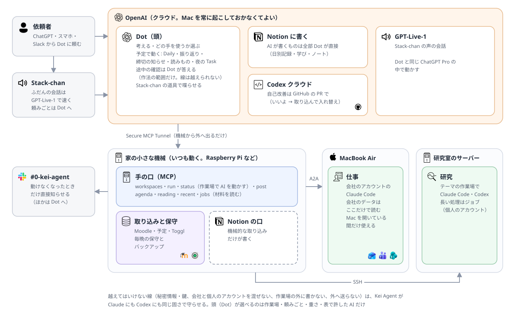
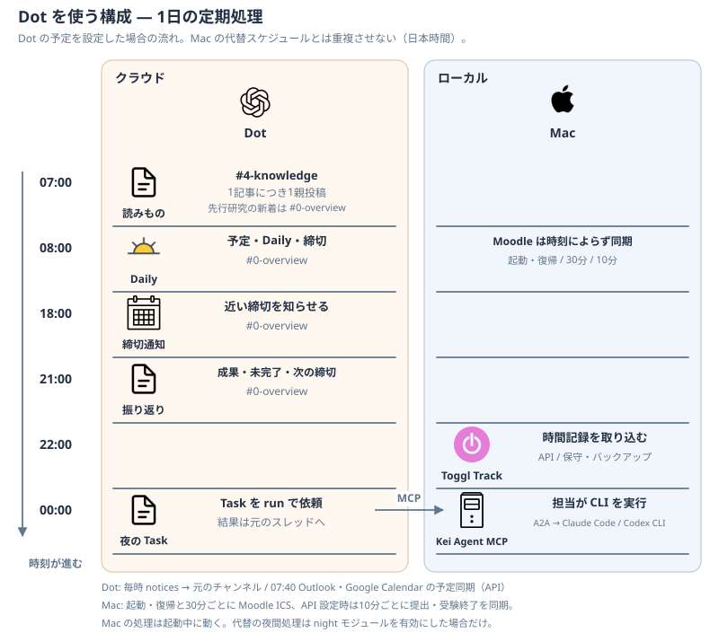

# Dot（Slack・通話・定期処理）

Slack で話しかける相手と、決まった時刻の処理は、OpenAI の Dot が受け持つ。Kei Agent はアシスタント全体の名前で、Dot での対話と Mac での実行を含む。Mac の実行サービスは Slack に直接接続しない。MCP サーバー・取り込み・ジョブ・担当（研究・仕事）と Moodle の同期だけを動かし、Dot に呼ばれて作業する。この文書は接続と定期処理の設定案内。貼り付ける指示の全文は [プロンプト一覧](prompts/README.md) にまとめている。

- Dot が使うのは、Kei Agent の MCP（[architecture.md](architecture.md#mcp-サーバー)）と、Dot 自身のプラグイン（Notion・Box・Slack・Outlook・Google Calendar・Gmail・Google Drive・GitHub）と Web
- 会社の Outlook の予定・メールは Dot が直接読む。Teams・SharePoint は会社の Claude アカウントを使うため、Mac の仕事担当に頼む。大学の Notion・Box と知識の Notion・Web は Dot が直接扱い、Mac に渡さない
- Slack では Dot をメンションし、元のスレッドで返事を受け取る。Dot の名前は Dot のプロフィールで「Kei Agent」にする。Slack の表示名への反映は、接続後に Slack で確認する（[Dot の名前設定](https://learn.chatgpt.com/docs/dots/getting-started)）。Mac を閉じていても答える
- Kei Agent は Slack に直接接続しない。通知は Outbox に保存し、Dot が MCP の `notices` で取得して Slack に投稿する。旧 Slack アプリのトークンは不要
- MCP は Mac で動く。閉じている間、予定・読みもの・Daily は Notion と Dot 自身の連携を使う。夜間の Task と MCP の知らせの確認は状態を変えずに次回へ回す
- Kei Agent に残す決まった時刻の処理は、秘密情報を使う取り込み（Moodle の課題・Toggl）と、保守とバックアップ（`maintenance`）。Dot の予定には秘密情報（URL の token・API キー）を置く場所が無いため。ほかの処理は `schedules.csv` で止める（下の「Kei Agent 側で止めるもの」）

## 個人開発

個人開発と Kei Agent 自身のクラウド修正は [個人開発ガイド](agents/development-agent.md) に従う。Dot が公開済み Codex クラウド環境へ直接依頼し、Mac の MCP を経由しない。プロジェクトの対応表と実行範囲は、[継続指示](prompts/dot-custom-instructions.md)の「個人開発」の節にある。

## 音声対話は Dot の通話

同じ Dot の通話で相談し、必要な作業を MCP に頼む。ChatGPT の Dot との会話で電話ボタンを押すか、デスクトップアプリの Dot のプロフィールで **Call** を選ぶ。通話中も文字で補足でき、通話を切っても依頼済みの作業は継続する。Slack と通話は同じ Dot を使う。製品が発言を両方へ自動転載するわけではない（[公式の通話仕様](https://learn.chatgpt.com/docs/dots/channels)）。

通話の指示は [カスタム指示の全文](prompts/dot-custom-instructions.md) に含む。通話の Slack 記録は利用者の依頼と投稿権限に従う。個別投稿の許可を継続的な自動記録には流用しない。記録を依頼され、許可された作業依頼は実行前に Slack の適切なチャンネルへ1依頼1親投稿で記録し、確認事項・進捗・結果をそのスレッドに残す。既存依頼の続きは同じスレッドを使う。Slack への記録に失敗した依頼は、記録できるまで実行を保留する。Slack と通話を同じ指示で設定する。

## Slack での受け答え（Dot の指示に入れる）

[カスタム指示の全文](prompts/dot-custom-instructions.md) のコードブロックを1回で貼る。受け答え・通話・プラグインと MCP の使い分け・安全と Notion の扱いを含む。

## 予定の一覧

時刻・出力先・貼り付ける指示は [プロンプト一覧](prompts/README.md) を正本とする。同名の既存予定を更新し、重複させない。文書を変更しても実設定は変わらない。

## 締切の知らせ（08:00・18:00）

[締切の知らせの全文](prompts/dot-deadlines.md) を両方の時刻に使う。

## Kei Agent 側で止めるもの

`~/.config/kei-agent/schedules.csv` で次を `false` にする。止めたあとも Mac の Kei Agent は、MCP と、研究・仕事の担当として動く。

| 名前 | 代わりの Dot の予定 |
|---|---|
| `daily` | 朝の一覧と Daily |
| `review` | 振り返り |
| `night` | 夜間の Task |

- 締切の知らせは Dot の予定だけが #0-overview に出す。大学モジュールは課題の取り込み・予定カレンダーへの同期を担当する

知識の読みもの・先行研究は Dot が実行する。ローカルの記事保存互換は [知識](agents/knowledge-agent.md#旧配信記事の保存) を参照。

## Kei Agent に残すもの

Moodle は [大学の同期](agents/course-agent.md#自動でしていること) に従い、起動・復帰時と30分ごとに締切を取得する。提出・受験終了は API 設定時のみ10分ごと。Mac が閉じている間、Notion は最終同期時点の状態となる。Moodle の取り込み範囲は180日。

| 名前 | 時刻 | 中身 |
|---|---|---|
| `intake` | 08:00 | Daily を止めると動く朝の取り込み。Moodle の課題を授業ホームの「課題」へ（`MOODLE_ICS_URL`）、声に1週間の予定。会議を予定カレンダーへ写すのは Dot の「カレンダーの同期」なので、ここでは写さない |
| `toggl_import` | 22:00 | Toggl の過去7日を共通ホームの「時間記録」へ（`TOGGL_API_TOKEN`） |
| `maintenance` | 22:00 | 保守とバックアップ |

- 大学の担当は課題を予定カレンダーへ同期し、API 設定時は提出・受験終了も確認する（[Moodle 連携の設定](agents/course-agent.md#moodle-の提出受験終了の同期)）。締切通知は送らない。課題の新着・変更・提出済みへの更新の知らせは notices に保存する

## Dot 側の設定

1. ChatGPT の Dot のプロフィールで名前を「Kei Agent」にし、Slack で表示を確認する
2. Dot のプラグインで Kei Agent の MCP と Notion・Box・Slack・Outlook・Google Calendar・Gmail・Google Drive・GitHub を有効にする。接続時の認証も確認する
3. Dot の指示に [カスタム指示の全文](prompts/dot-custom-instructions.md) を入れ、各予定に [プロンプト一覧](prompts/README.md) から対応する全文を入れる。同名の古い予定は重ねて作らず更新する
4. Settings → Personalization → Permissions → Custom rules に、会議の参加リンクとパスコードの掲載、`#0-overview` への指定された投稿、依頼の投稿へのリアクション（👀 ✅ ❓ ⚠️）の3つを入れる。リアクションのルールが無いと、Dot は承認待ちで止まる
5. 共通ホームに作業記録の DB「Dot Work Log」（Task・Status・engine・model・effort・Duration・Started At・Ended At）を置く。Duration は Started At と Ended At から数式で出す
6. ローカルの schedules.csv は上の停止対象だけ false にする。設定変更と再起動は利用者が行う
7. Kei Agent のプラグインで MCP サーバーを再スキャンし、post が無く、status が phase と elapsed_seconds を返し、sync_submissions・handoff・save_reading・voice がツール一覧にあることを確認する（[MCP サーバー](architecture.md#mcp-サーバー)）

Dot のプラグインと module.toml の connectors は別の実行環境の設定。プラグインを接続しても、ローカルの担当に認証や権限が自動で渡るわけではない。予定・メール・資料・GitHub の検索は Dot の接続を使い、Mac の作業場での実行は MCP に渡す。

Dot が利用できるプラグインと接続の区別は [公式の Computers & apps](https://learn.chatgpt.com/docs/dots/computers-and-apps)、Slack での進捗の頼み方は [Channels](https://learn.chatgpt.com/docs/dots/channels) を参照する。Slack のリアクションと開始メッセージは Dot の指示として運用し、機械的な状態取得は MCP の status を使う。

継続指示は Dot との会話で伝える。権限の保存結果は Settings → Personalization → Permissions → Custom rules、定期実行の指示・時刻・投稿先はプロフィールの Scheduled で確認する。承認フォームの「保留中ではない」という表示だけでは、承認済みかどうかを判断しない。公式の [Dot の操作とルール](https://learn.chatgpt.com/docs/dots/controls)、[MCP の再スキャン](https://developers.openai.com/plugins/build/mcp-events#test-in-chatgpt) を参照する。

## Mac の定期実行

- 本体のスケジューラが毎分動く。時刻とオンオフは `schedules.csv`、未記載なら各処理の既定値を使う
- 同時刻は、夜間 Task → モジュールの定期処理 → 朝の取り込み → Daily → 振り返り → 保守の順
- スリープで逃した処理は3時間以内、任意のローカル `night` は12時間以内なら動く。利用上限中の再実行は上限が明けてから
- 24時間放置された返事待ちには毎分の確認で一度だけ声をかける
- 手動実行は `uv run kei-agent-schedule <名前>`。`--record` なしでは実行済みの記録を付けないが、通知や Notion は更新し得る
- ローカルの `daily` は08:00、`review` は21:00が既定。Dot の予定を使う構成では両方停止する
- ローカルの夜間 Task は任意の `modules/night/` が取得・実行・状態更新を持つ。[設定と実行条件](modules.md#夜間の-task) を参照。Dot の夜間 Task と二重に動かさない

## ローカルの Daily・振り返り

Dot の予定を使わず、任意の `daily` モジュールを有効にする場合の実装。

- 朝の一覧（`core.morning`）を出し、そのスレッドに Daily を書く
- 材料（`core.digest`）は本体の記録・モジュールの材料・研究ホーム・前日の振り返り。3万字を超えたら後ろから削る
- 研究全体の作業場を読むだけで動かす（`core.run_ai(overview=True)`）
- 答えの見出しが違えば出さず、決まった文で知らせる（`core.checked_sections`）
- 共通ホームの「日別記録」に1日1行で残す。振り返りのスレッドは daily が引き取り（`core.claim_thread`）、学びの会話を知識ホームの「Knowledge」に残して、題とリンクを日別記録にも足す
