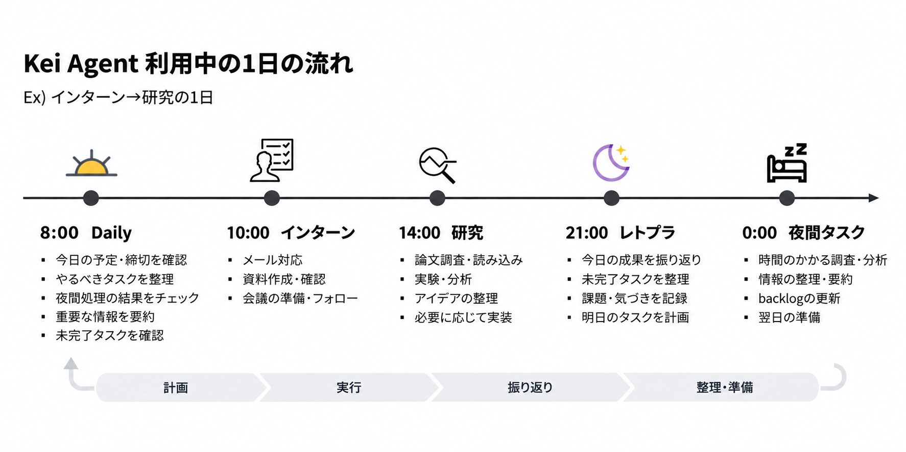
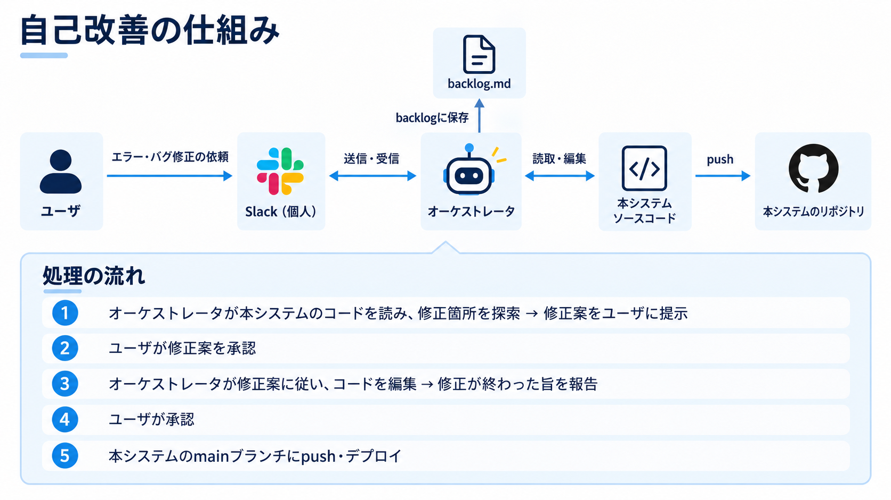

# 使い方

Slack で Kei Agent に頼むときの案内。入れ方は [`deploy/README.md`](../deploy/README.md)、仕組みは [`architecture.md`](architecture.md)。

## チャンネル

| チャンネル | 何を頼むか | 取り次ぐ先 |
|---|---|---|
| `#00_kei-agent` | Kei Agent 自身への要望・不具合。うまく動かなかったときの知らせもここに届く | 本体（自己改善） |
| `#01_overview` | 全体の相談。Daily と Retro & Planning が届く | 本体 → 各エージェント |
| `#02_research-strategy` | 中長期の方針 | 本体 |
| `#10_<テーマ>` | そのテーマの研究作業 | 研究エージェント |
| `#20_course` | 授業と課題 | 大学エージェント |
| `#30_work` | 会社の予定・メール・資料 | 仕事エージェント |

- 先頭の番号は並び順のためのもの。照合するときは番号を外す（フォルダ名と Notion のテーマ名も番号なし）
- 上のどれにも当たらないチャンネルに招待すると、研究テーマとして扱う
- スレッドの外では `@Kei Agent` のメンションが要る。Kei Agent が動いているスレッドの中ではメンションなしで続けられる
- 指示できるのは `KEI_AGENT_ALLOWED_USER_ID` の1人だけ

## 頼んだあとの見え方

- 受け取ると 👀、終わると ✅（エラーなら ⚠️）が依頼のメッセージに付く
- いま何をしているかは入力欄の下に1行（「調べている…」など）だけ出る
- Slack の本文には結論だけが出る。途中の考えや手順は出ない
- 図やファイルは `outputs/fig.png` のような作業場の中の名前で書かれ、新しくできたファイルはスレッドに添付される
- 数分以上かかる作業はジョブにして、終わると同じスレッドで報告が来る
- 違うスレッドの依頼は同時に2件まで動く。同じスレッドの中は順番

## 返事の最後に付く合図

| 合図 | 意味 | 何が起きるか |
|---|---|---|
| `❓ 確認: …` | 判断してほしいことがある | 返事待ちになる。24時間放置すると一度だけ声をかけ、さらに放置すると閉じる |
| `🧵 区切り: 題` | ひと段落した | [新しいスレッドで続ける] ボタンが出る。押すと引き継ぎメモ付きで新しいスレッドができる。依頼が8回たまったときも出る |
| `🔒 接続: <ホスト>（理由）` | 許可していない接続先が要る | [許可する] [断る] のボタン。押すとスレッドの作業が自動で再開する。許可はテーマごと、チャンネルをアーカイブすると消える |
| `🛠 着手` / `📦 取り込み` | `#00_kei-agent` で直し始める／取り込む | 下の「自己改善」 |

自分からは次のリアクションが使える。

- 🌙 … 自分のメッセージに付けると Notion に「今夜やる」Task ができ、00:00 から実行される（一晩5件まで）。00:00 までに外せば取り消せる

## 研究（`#10_<テーマ>`）

1. チャンネルを作って Kei Agent を招待すると、`~/research/<テーマ>/` と `CLAUDE.md` のひな形、Notion の「テーマ」の行ができる
2. `@Kei Agent 〜して` と頼む

- 添付したファイルは `inputs/` に入る
- テーマの前提（分野、ジョブにする基準、先行研究の `## 検索キーワード`）は `CLAUDE.md` に書く
- 依頼の頭に `[[research-design]]` などのラベルを付けると、モデルの深さを指定できる（[architecture.md](architecture.md#5-provider-とモデル)）
- テーマを終えたらチャンネルをアーカイブする。定期処理がそのテーマを見なくなる

## 大学（`#20_course`）

- 「課題を取り込んで」… Moodle の締切を Notion の「課題」に入れる（履修している科目だけ）
- 「締切を教えて」… これから2週間ぶんを近い順に
- 「今週どれくらいやった？」… Toggl の記録を科目ごとに集計する
- そのほか … Box の学部要項・過去問、授業ホームの授業・課題・成績・単位要件を読んで、根拠付きで答える

締切は朝の予定と、24時間前の個別の知らせでも届く。課題の提出の代行はしない。

## 仕事（`#30_work`）

- 「今日の予定は？」「今週の予定は？」… Outlook の会議
- そのほか … メール・SharePoint・Teams を読んで答える。長いものは要点をまとめて必要なところだけ引く

送信、予定の作成・変更・削除はできない（読むだけ）。

## 時間の記録（`/toggl` と時間記録カード）

`10_`・`20_`・`30_` のチャンネルで測る。入口は2つで、どちらも同じ計測を動かす。

| 入口 | 使い方 |
|---|---|
| `/toggl` | 引数なしなら切り替え（このチャンネルで計測中なら止め、そうでなければここで始める）。`/toggl start`（`開始`）、`/toggl stop`（`停止`）も使える。返事は自分にだけ見える |
| 固定した「⏱️ 時間を記録する」カード | [開始]、計測中は [停止] と [メモを追加]。`/toggl` で動かしたときもカードの表示が変わる |

- 同時に測れるのは1本だけ。別のチャンネルで始めると、前の計測はその時刻で止まる
- `20_` のチャンネルでは始めるときに今学期の授業を選ぶ画面が出る。一度選ぶと、そのチャンネルは選んだ授業を覚える
- 止めた記録は Toggl に送り、研究・大学・仕事のどれも共通 Notion ホームの「時間記録」に書く。週ごとの合計は「時間記録」のグラフ（週ごとの時間）で見る
- Toggl のアプリで直接測った時間も、プロジェクト名の先頭を `研究/` `大学/` `仕事/` にしておけば、毎晩「時間記録」に入る
- Toggl の設定が無いときは Toggl を飛ばして Notion にだけ書く
- 送れなかったものは後で自動で送り直す。Toggl に届いたか分からないときだけ [Togglへ再送] ボタンが出る

## 定期実行

| 時刻 | 届くもの | 場所 |
|---|---|---|
| 07:00 | 先行研究の新着（新着がなければ投稿しない） | テーマのチャンネル |
| 08:00 | 今日の予定（授業・会議・締切）を時刻順に1通。そのスレッドに Daily（今日のタスク／夜間処理の結果／確認待ち・期日・止まっているテーマ・返事待ち／今日考えるとよい問い） | `#01_overview` |
| 21:00 | Retro & Planning（今日の成果／未完了タスク）と「夜間に実行したいタスクはありますか？」 | `#01_overview` |
| 22:00 | 保守（古いファイルの整理、Toggl で直接測った時間の取り込み、バックアップ） | — |
| 00:00 | 🌙 を付けた Task | 元のスレッド |

- Daily と Retro & Planning は共通 Notion ホームの「日別記録」に1日1行で残る（手元のファイルには残さない）
- Retro & Planning のスレッドに振り返りの結論を貼ると、日別記録のレトプラに追記され、翌朝の Daily に反映される
- Mac がスリープで逃した処理は、起きたときに動く（3時間以内。夜間の Task は12時間以内）

## 自己改善（`#00_kei-agent`）

1. 要望や不具合を書く。要約だけが公開の GitHub issue（ラベル `kei-agent-request`）になり、番号がスレッドに返る。Slack の文・URL・名前・パスは載せず、原文は Slack にだけ残る
2. Kei Agent がコードを読んで直し方の案を出す
3. 同意すると「これで進めていい？」と聞かれ、もう一度「いいよ」で `🛠 着手`。別の作業ツリーで直し、変えたファイル・差分・テスト結果を見せる
4. 見て「いいよ」と言うと `📦 取り込み`。テストして main に取り込み、push して新しい版で起動し直す。起動できたら issue を閉じる

issue にできなかったとき（自己改善の AI が未選択、`gh` の失敗、要約が条件に合わない）は、そう知らせて案だけ続ける。
`src/kei_agent/guard.py`、`config.toml`、`deploy/` に触れる変更は取り込まない（人が直す）。

## App Home（設定）

Slack で Kei Agent を開き、[ホーム] タブで次を変えられる。

- いま動いている依頼・ジョブ・返事待ちの確認
- AI 実行器（agent ごとに Claude か Codex）
- テーマごとに許可した接続先（足す・外す）
- 声の「知らせる」「聞く」（どちらも既定は切）
- 決まった時刻の処理の時刻とオン・オフ、その場で動かすボタン

同時に動かす数、上限時間、書き込み先、読ませない場所、基本の接続先は `config.toml` のままで、Slack からは変えられない。

## 声

App Home で入れたときだけ動く。机の上のロボット（Stack-chan）はまだ無いので、声は Mac から出る。

| スイッチ | 入れると |
|---|---|
| 知らせる | 作業が終わった・止まった・返事待ち・締切・上限を声で知らせる。マイクは開かない |
| 聞く | マイクを開けて Realtime API につなぐ。つながっている間は、そのまま話しかければ答える（喋っている途中で割り込める）。切るとつながりごと切れる |

- 予定・締切・Kei Agent の様子はすぐ答える。研究・授業・仕事の中身は、本体を通して担当エージェントに読むだけで聞いてから答える（声から Notion などを書き換えることはない）
- 作業を頼むと、渡す前に読み上げて確認する。「いいよ」と答えると `🎤 声からの依頼` のスレッドが立ち、いつもどおり作業する
- 話した中身は残さない（依頼は Slack のスレッドに残る）
- つながっている間は喋ったぶんだけ料金がかかる
