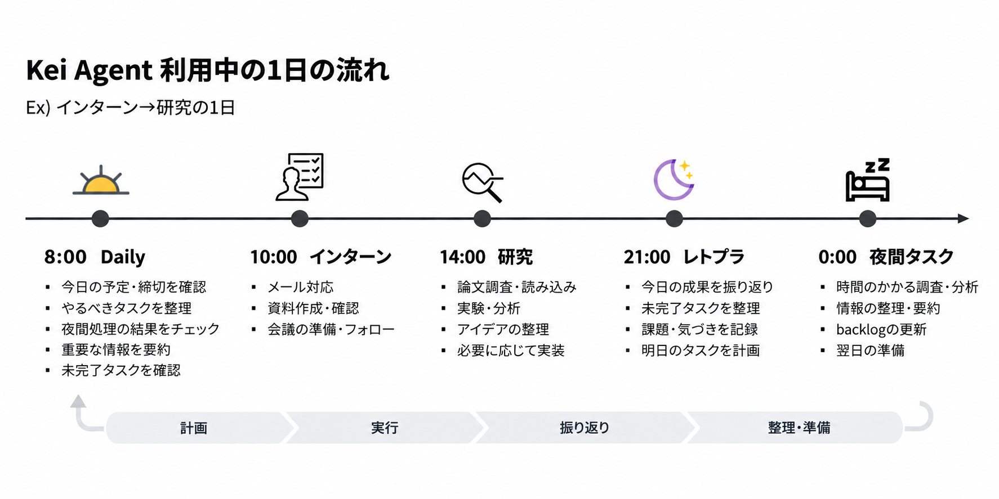
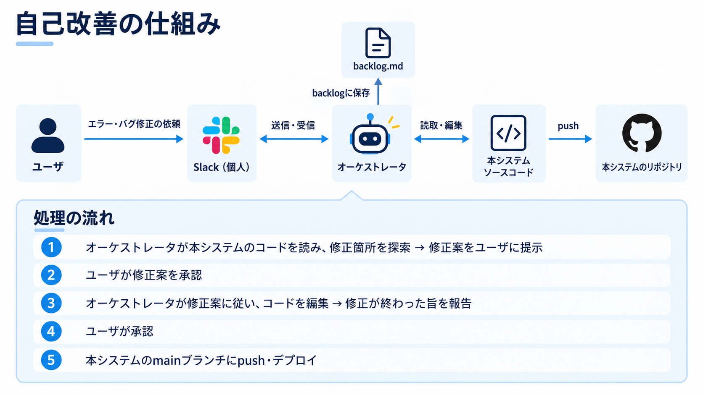

# 使い方

- Slack で Kei Agent に頼むときの案内
- 担当ごとの中身は [`agents.md`](agents.md)、入れ方は [`deploy/README.md`](../deploy/README.md)

## チャンネル

| チャンネル | 頼むこと | 受け持ち |
|---|---|---|
| `#00_kei-agent` | Kei Agent への要望・不具合。困りごとの知らせも届く | 自己改善 |
| `#01_overview` | 全体の相談。Daily と振り返りが届く | 本体が担当に振り分ける |
| `#10_<テーマ>` | そのテーマの研究 | [研究](agents/research-agent.md) |
| `#20_course` | 授業と課題 | [大学](agents/course-agent.md) |
| `#30_work` | 会社の予定・メール・資料 | [仕事](agents/work-agent.md) |
| `#40_knowledge` | 朝の読みもの、記事と論文の質問 | [知識](agents/knowledge-agent.md) |

- 先頭の番号は並び順のため。照合するときは外す
- 上のどれでもないチャンネルに招くと、研究テーマになる
- スレッドの外では `@Kei Agent` を付ける。Kei Agent が動いているスレッドの中なら要らない
- 頼めるのは `KEI_AGENT_ALLOWED_USER_ID` の1人だけ

## 返事の見え方

| 見えるもの | 意味 |
|---|---|
| 👀 → ✅ | 受け取った → 終わった。止まったら ⚠️ |
| 入力欄の下の1行 | いましていること（「調べている…」など） |
| 本文 | 結論だけ。途中の考えや手順は出ない |
| 添付 | 作業場で新しくできたファイル |
| 同じスレッドの報告 | 数分以上かかる作業はジョブにして、終わったら報告する |

- 違うスレッドは同時に2件まで動く。同じスレッドの中は順番

## 返事の最後の合図

| 合図 | 意味 | 起きること |
|---|---|---|
| `❓ 確認: …` | 判断してほしい | 返事待ちになる。24時間たつと一度だけ声をかける |
| `🧵 区切り: 題` | ひと段落した | [新しいスレッドで続ける] ボタン。引き継ぎメモ付きで新しいスレッドができる。依頼が8回たまったときも出る |
| `🔒 接続: <ホスト>（理由）` | 許していない接続先が要る | [許可する] [断る] ボタン。許すと作業を続ける。許可はテーマごと |
| `🛠 着手` / `📦 取り込み` | 直し始める / 取り込む | 下の「自己改善」 |
| `✅ 解決済み` / `🗑 見送り` | 直さずに終わる（もう直っていた / やらない） | 下の「自己改善」 |

## リアクション

| リアクション | 付ける所 | 起きること |
|---|---|---|
| 🌙 | 自分のメッセージ | Notion に「今夜やる」Task ができ、00:00 から実行する（一晩5件まで）。外せば取り消し |
| 👍 | 朝の読みもの | 共通ホームの「読みもの」に入る。外すとゴミ箱に入れる |

## 時間の記録

| 入口 | 使い方 |
|---|---|
| `/toggl` | 引数なしで切り替え。`/toggl start`（`開始`）・`/toggl stop`（`停止`）も使える。返事は自分にだけ見える |
| 固定したカード「⏱️ 時間を記録する」 | [開始]、計測中は [停止] と [メモを追加] |

- 測るのは `10_`（研究）・`20_`（大学）・`30_`（仕事）のチャンネル。`config.toml` の `[time] prefixes` で変えられる
- 測れるのは1本だけ。別のチャンネルで始めると、前の計測は止まる
- `#20_course` では、始めるときに今学期の授業を選ぶ
- 止めると Toggl と、共通ホームの「時間記録」に送る。Toggl の設定が無ければ Notion にだけ書く
- Toggl のアプリで直接測った時間は、プロジェクト名の頭を `研究/` `大学/` `仕事/` にすれば、毎晩 22:00 に「時間記録」に入る
- 送れなかったものは自動で送り直す。Toggl に届いたか分からないときだけ [Togglへ再送] が出る

## 定期実行

| 時刻 | 届くもの | 場所 |
|---|---|---|
| 07:00 | 論文の新着（関係のあるものだけ最大5本） | テーマのチャンネル |
| 07:00 | 読みもの（技術記事5件） | `#40_knowledge` |
| 08:00 | 今日の予定（授業・会議・締切）と、そのスレッドに Daily | `#01_overview` |
| 21:00 | 振り返り（今日の成果・未完了）と、明日・明後日の締切 | `#01_overview` |
| 22:00 | Toggl の取り込み、保守（古いファイルの整理とバックアップ） | — |
| 00:00 | 🌙 を付けた Task | 元のスレッド |

- 時刻とオン・オフは App Home で変えられる
- Daily と振り返りは、共通ホームの「日別記録」に1日1行で残る
- 振り返りのスレッドに結論を貼ると、日別記録に足され、翌朝の Daily に効く
- Mac のスリープで逃した処理は、起きてから動く（3時間以内。夜間の Task は12時間以内）

## 自己改善（`#00_kei-agent`）

1. 要望や不具合を書く。要約だけが公開の GitHub issue になり、原文は Slack に残る
2. Kei Agent がコードを読んで、直し方の案を出す
3. 同意すると `🛠 着手`。別の作業ツリーで直し、変えたファイル・差分・テストの結果を見せる
4. 「いいよ」で `📦 取り込み`。テストして main に取り込み、新しい版で起動し直して issue を閉じる

- 直さなくてよい（もう直っていた）・やらない、と決まったら、同意したときに `✅ 解決済み` / `🗑 見送り`。要望を終わりにして issue を閉じる（見送りは GitHub の「not planned」）。取り込み待ちの直しは捨てる
- issue を閉じられなかったとき（ネットが切れていたなど）は、1日1回やり直す
- `guard.py`・`config.example.toml`・`deploy/` に触れる変更は取り込まない（人が直す）
- 本物の設定（`~/.config/kei-agent/`）はリポジトリの外なので、自己改善では変わらない

## App Home

| 項目 | できること |
|---|---|
| 動いているもの | 動いている依頼・ジョブ・返事待ちを見る |
| AI | 担当ごとに Claude か Codex を選ぶ。選ぶまで、その担当は動かない |
| 定期実行 | オン・オフと時刻 |
| 声 | 「知らせる」「聞く（マイク）」。どちらも既定は切 |
| 接続先 | テーマごとに許した接続先を足す・外す |

- 同時に動かす数・上限時間・書き込み先・読ませない場所・基本の接続先は `config.toml` だけで変える

## 声

| スイッチ | 入れると |
|---|---|
| 知らせる | 作業の終わり・止まり・返事待ち・締切・上限を声で知らせる。マイクは開かない |
| 聞く | マイクで会話する。喋っている途中で割り込める。切るとつながりごと切れる |

- 予定・締切・Kei Agent の様子は、すぐ答える
- 研究・授業・仕事の中身は、本体を通して担当に読むだけで聞いてから答える
- 作業を頼むと、読み上げて確かめてから `🎤 声からの依頼` のスレッドを立てる
- 話した中身は残さない。会話の間は、喋ったぶんだけ料金がかかる
